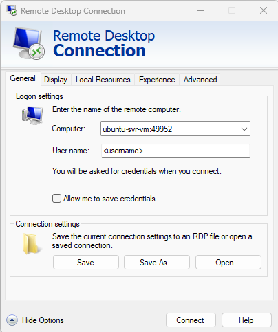
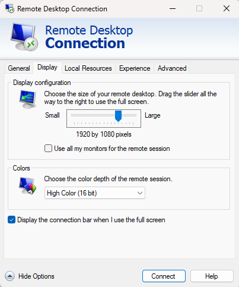
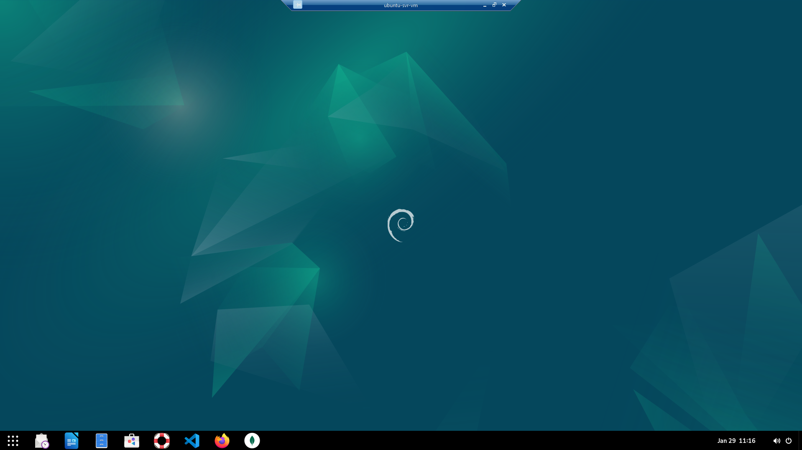

# Knowely.com Django

This overview isn't a comprehensive guide to setting up and configuring an Ubuntu VM on a Windows 11 PC. Instead, it details how I mimicked my company's work environment while taking training courses from [Coursera](https://www.coursera.org/), [Knowely](https://app.knowely.com/), [Pluralsight](https://www.pluralsight.com), and [Udemy](https://www.udemy.com/).

This repository has most, if not all, of the assignments for Knowely.com Django

This was created to track and keep coursework divided, as an after thought, there could have been a tree structure in app/ and tests/ i.e. app/coursera/assignment_01 and tests/coursera/test_assignment_01 but doing without planning causes wishing :)

## Build a Ubuntu 22.04 vm on Windows

Hyper-V Manager on Windows 11

- [How to Install Ubuntu 24.04 or 22.04 Linux on Windows with Hyper-V](https://linux.how2shout.com/how-to-install-ubuntu-22-04-linux-on-windows-with-hyper-v/)
- [How to Connect to an Ubuntu Server via SSH from Windows: A Step-by-Step Guide](https://xemiron.com/how-to-connect-to-an-ubuntu-server-via-ssh-from-windows-a-step-by-step-guide/)

- Access to the Virtual Machines can be via the Hyper-V Connect screens or via MSTSC/RDP (Microsoft Terminal Services Client / Remote Desktop Connection).

    [How to RDP into the Ubuntu VM](https://phoenixnap.com/kb/ubuntu-remote-desktop-from-windows)

    Instructions show an IP address, but an RDP, as shown below, can occur if the hostname is configured on the Ubuntu VM.

       

```bash
# As of this writing: Max Screen Size is 1920 x 1080 and Color Depth cannot be greater than 'High Color (16 bit)'
```

```bash
# If a Black Screen is showing in the RDP, perform the following

    sudo adduser xrdp ssl-cert                          # Adds the xrdp user to the ssl-cert

    sudo nano /etc/xrdp/startwm.sh                      # If using ubuntu : gnome, Add the two export lines to the top of the file

        export GNOME_SHELL_SESSION_MODE=ubuntu
        export XDG_CURRENT_DESKTOP=ubuntu:GNOME

    sudo nano /etc/xrdp/xrdp.ini                        # In the [Globals] section

    # change first value to second value

        port=3389     port=49952
        max_bpp=32    max_bpp=24                        # any other place you find max_bpp

reboot the PC/VM
```

Also installed on the Ubuntu VM...

- [Docker](https://get.docker.com)
    > The following script is not recommended for production environments:
    >> curl -fsSL [https://get.docker.com](https://get.docker.com) -o get-docker.sh sudo sh get-docker.sh
- [git](https://git-scm.com/downloads/linux)
    > sudo apt-get install git
- [Gnome](https://www.wikihow.com/Install-Gnome-on-Ubuntu)
    > sudo apt install ubuntu-gnome-desktop
- [MongoDB Community Server](https://www.mongodb.com/try/download/community)
- [Mongoose Compass](https://www.mongodb.com/try/download/compass)
- [DBeaver Community](https://dbeaver.io/download/)
- [OneDrive](https://ubuntuhandbook.org/index.php/2024/02/install-onedrive-ubuntu/)
    > sudo apt install onedrive
- [Postman](https://bytexd.com/how-to-install-postman-on-ubuntu/)
- [PowerShell](https://learn.microsoft.com/en-us/powershell/scripting/install/install-ubuntu?view=powershell-7.4)

## Environment used during the coding and testing phases

Windows 11 with an SSH connection to Ubuntu 24.04 vm

VS Code  
pyenv  
Python 3.10.16  
[Run Django on Visual Studio Code](https://medium.com/@abdullahsohailcs/how-to-run-django-on-visual-studio-code-using-the-integrated-terminal-using-the-integrated-e73bbe80cd91)

Basic Steps for [How to install Pyenv in Ubuntu 22.04](https://itslinuxfoss.com/install-use-pyenv-ubuntu/)

```text
Step 1: Update the Ubuntu Repository
    $ sudo apt update

Step 2: Download the Script of Pyenv in Ubuntu
    $ curl https://pyenv.run | bash

        If any dependencies error occurs, such as curl or git, then you can use the following commands to get rid of them:
            $ sudo apt install curl -y
            $ sudo apt install git -y
    
Step 3: Add the Environment Variables Into bashrc File
    $ export PATH="$HOME/.pyenv/bin:$PATH" && eval "$(pyenv init --path)" && echo -e 'if command -v pyenv 1>/dev/null 2>&1; then\n eval "$(pyenv init -)"\nfi' >> ~/.bashrc
    
Step 4: Restart the Shell in Ubuntu
    $ exec $SHELL

Step 5: Display the Installed Version of the Pyenv in Ubuntu
    $ pyenv --version
    
Step 6: Install Python Version 3.10.16
    $ pyenv install 3.10.16

Step 7: Validate Successful installation
    $ pyenv versions
    
Step 8: Set pyenv python version
    $ pyenv global 3.10.16
    $ pyenv local 3.10.16   - This will generate/replace the .python-version file if done within VS Code
```

## Other installs and miscellaneous items

### Markdown Information

[Markdown Guide](https://www.markdownguide.org/)  
[Markdown Guide - Extended Syntax](https://www.markdownguide.org/extended-syntax/)  
[Markdown Cheat Sheet](https://www.markdowncando.com/reference/cheatsheet/)

For better image clarity in Markdown files, image formatting is as follows:

```html
# Examples
" alt="<Alt Text>" style="width:auto;height:auto;">
" alt="<Alt Text>" style="width:300px;height:auto;">
" alt="<Alt Text>" style="width:auto;height:300px;">
```

but if you're storing the page in [BitBucket](https://bitbucket.org/tutorials/markdowndemo/src/master/#markdown-header-code-and-syntax-highlighting), use the following

```test


```

### Install Anaconda (`for data science purposes`)

[**The Operating System for AI**](https://www.anaconda.com/)

(`All operating systems`) A download from [Anaconda](https://www.anaconda.com/download/)

## Commands used during coding and testing

[This Repository on GitHub](https://github.com/mcspidy/knowely_python_core)

To utilize this repository, fork a copy to your [GitHub.com](https://GitHub.com) account

### Defaults

[requirements.txt](https://github.com/mcspidy/knowely_python_core/blob/main/requirements.txt) contains black, flake8, matplotlib, numpy, pandas, pep8, and pytest (my common development packages)

```bash
git branch                                  # displays all branches

git checkout -b <new branch>                # adds new branch
```

don't forget to commit and sync to save

```bash
git checkout main                           # returns to default state
```

### Create a Link in your working directory for faster access

Faster way to get to the project (Ubuntu)

```bash
cd <project library>
ln -s ~/<Local Clone Parent Folder>/knowely_python_core knowely_python_core
```

### Set a virtual environment

```bash
# Linux / Ubuntu
sudo apt-get install python3-venv           # If needed
python -m venv <virtual environment>
source <virtual environment>/bin/activate

# macOS
python3 - venv <virtual environment>
source <virtual environment>/bin/activate

# Windows
py -3 -m venv <virtual environment>
<virtual environment>/bin/activate

deactivate                                  # to deactivate the virtual

# If space is a concern; delete the <virtual environment> location, it can always be re-created
```

### Module not Found

```text
Issue

- Python can't find my module
- Python can't find module in the same folder

Solution 

- Replacing the current PYTHONPATH with the local library

    export PYTHONPATH=$(pwd)
    
    or 

- Adding the local library to the current PYTHONPATH
    
    export PYTHONPATH=$PYTHONPATH:$(pwd)
```

### Install packages

```bash
python -m pip install --upgrade pip
python -m pip install -r requirements.txt

# The following should be placed in the requirements.txt file

python -m pip install flake8
python -m pip install black
python -m pip install django
python -m pip install django-extensions
```

### Django

#### Commands (when using venv)

```bash
# Example - Needed for new Django App
    - Create venv
    - python -m pip install django
    - django-admin startproject web_project .

python manage.py migrate
python manage.py makemigrations
python manage.py loaddata <datafile.json>   # if using database
python manage.py runserver                  # ctrl-c to exit when running in terminal
```

#### Django Links

>
>[Django Tutorial in VS Code](https://code.visualstudio.com/docs/python/tutorial-django)
>
>[Django Fixtures Tutorial: How to use dumpdata and loaddata](https://learndjango.com/tutorials/django-fixtures-dumpdata-loaddata)
>
[John Sully videos](https://www.youtube.com/@johnsolly/videos)
>
>>[Ultimate One-click Django Debugging. Runserver, livereload, launch chrome all at once!](https://youtu.be/C5M2cy80LxE?list=PL1pc4P-E8TnRehFJPmhQOQCwTdygsxZIx)
>>
>>[Enable Unittest for Django Projects in VSCode](https://youtu.be/7RaPq2BnPCI?list=PL1pc4P-E8TnRehFJPmhQOQCwTdygsxZIx)
>>
>>[How to turn on logging in your Django App](https://youtu.be/Z7BOBn8B5qA?list=PL1pc4P-E8TnRehFJPmhQOQCwTdygsxZIx)
>>
>>[My Django logging setup explained in detail](https://youtu.be/m_EkU56KdJg?list=PL1pc4P-E8TnRehFJPmhQOQCwTdygsxZIx)
>>
>>[How to Debug a Django Application is VS Code](https://youtu.be/spmFjhQIKOo)
>>
>>[Logging in Django Apps](https://youtu.be/m_EkU56KdJg)
>>

### One Line Command for testing setup

```bash
python -m venv .venv && source .venv/bin/activate && python -m pip install --upgrade pip && python -m pip install -r requirements.txt && export PYTHONPATH=$(pwd)
```

## Always refer to the MAIN branch

```text
Newer README.md documentation will only be updated on the main branch, sub-branches will not be updated.
```

## Free videos

[Tutorials and walkthroughs for software developers, programmers, and engineer by Corey Schafer](https://www.youtube.com/@coreyms)
